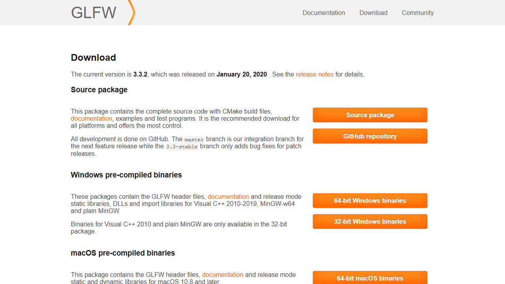

# What is this?
This is an OpenGL tutorial for the C++ programming language in Windows.
It should also work on Mac with a few compiler and library tweaks.

## Why make this?
Around 2008 I wanted to learn how to make a game engine in DirectX or OpenGL, and found no satisfting tutorials.
Eventually, through piecing together many (now dead) tutorials, I was able to get my foot into the world of DirectX.

Recently, (2020) I tried to teach someone else OpenGL, but found that there STILL was no satisfying tutorials, so I'm writing this to be the tutorial I wished I had.
If you have problems anywhere along the line, or wish this was in another language, please send me an email at <joseph.b.kessler@gmail.com>

## Where do I start?
This tutorial follows OpenGL from its earliest form, to its more modern variants using as as little external tools as possible.
For simplicity, we are going to download precompiled binaries to reduce compiler headaches.
This tutorial will use Visual Studio Community 2019. (not visual studio code)

##Creating the project
To start, we are going to create a project, and download GLEW and GLFW:
First, create a folder to put your project in.  Mine will be named oglcpp.
Open visual studio and select create a new project.  You'll want a console application.
Change the project name and the location to where you want the project to go.
Be sure "Place solution and project in the same directory" is checked.
After the project is created, you should see an empty hello world, and a file structure that looks like this:

##GLFW

GLFW creates an interface between the OS and OpenGL. To download it, first click this link.
[https://www.glfw.org/](https://www.glfw.org/)

Click the Download section at the top, not the download button.

Click 64-bit Windows binaries.

Create a folder titled "gl" within your project folder.  Within this folder, make a folder titled "glfw".
Extract the contents of the downloaded binaries into the glfw folder. If there are now single folders within glfw, move them to the above folder until glfw contains the lib folders, and the LISCENCE.md file.

##GLAD
GLAD is an loader that allows you to use OpenGL functions. We have to set the version to use, and weather we are using compatibility functions, or just the core. To download it, click this link.
[https://glad.dav1d.de](https://glad.dav1d.de)

Click the dropdown next to gl under API, and set the version to the latest, or 3.3 if you are on a mac.
Change the profile to compatibility, and all the way at the bottom click generate.

Click on glad.zip to download it.

Like GLFW above, we want to create a "glad" folder within the gl folder. Extract the contents of the zip so they are as high up as possible within that folder, so it looks like the screenshot.  

##Attaching GLAD and GLFW to the project
